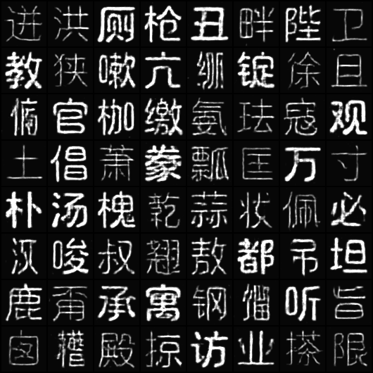

# DCGAN-Zi

## Implemented DCGAN, conditional-GAN for styled writing generation.

Wrting styles are gradually picked up during training. Each sub-image in the grid has different latent space noise vector, so their styles show variation.

More compact neural networks are utilized here compared to other repos, [RestoreAe-Zi](https://github.com/Shawn-SFYu/RestoreAE-Zi) and [StyleVAE-Zi](https://github.com/Shawn-SFYu/StyleVAE-Zi), considering currently limited computation resources. Generators are implemented based on autoencoder and U-net structures. 

As one example, this pair of images shows changes in writing styles. The first image is standard writing , and the second image shows the generation results after 30 training epochs. 

The generated images ...

Conditional GAN is found to be necessary in this styled writing generation. Though GAN can generate plausible results, the results mostly don't belong to any character class (People would think they are wrong written). This is an intrisic difference between this writing generation and other image generatin tasks, such as faces or scenes.

Example training configurations are listed in yaml files.